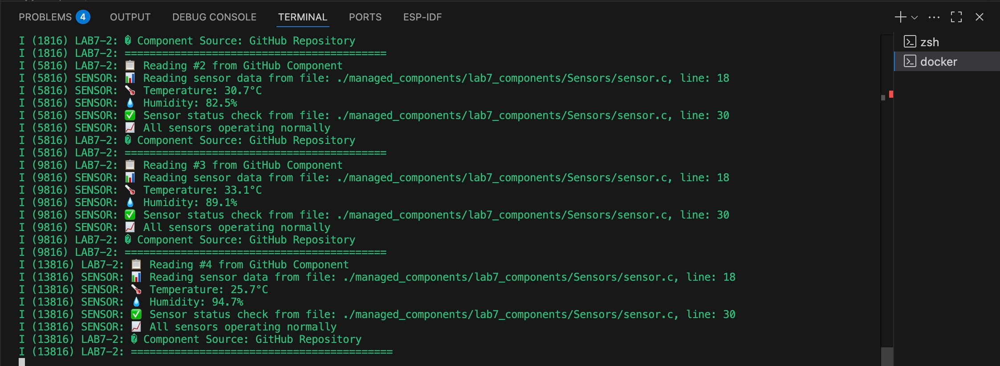

# Lab 7-2: Managed Component from GitHub URL Demo

## คำอธิบาย
การทดลองนี้แสดงการใช้งาน managed component จาก GitHub Repository
ใช้ `Sensors` component จาก https://github.com/APPLICATIONS-OF-MICROCONTROLLERS/Lab7_Components

## ผลลัพธ์ที่คาดหวัง
- แสดงข้อความการเริ่มต้น sensor จาก GitHub component
- แสดงข้อมูล temperature และ humidity ทุก 4 วินาที
- แสดงสถานะการทำงานของ sensor
- แสดงแหล่งที่มาของ component (GitHub Repository)

## ความแตกต่างจาก Lab 7-1
- Lab 7-1: ใช้ local component (ในเครื่อง)
 ที่มาของ component: อยู่ในเครื่องเอง (components/ ของโปรเจกต์) 
 อินเทอร์เน็ต: ไม่ต้องใช้
การติดตั้ง: สร้างโฟลเดอร์และใส่ไฟล์ component เอง
การอัปเดต: ต้องแก้ไขไฟล์เอง
ข้อดี: Build ผ่านแน่นอนถ้าไฟล์ครบ
ข้อเสีย: ต้องจัดการไฟล์ component เอง

- Lab 7-2: ใช้ managed component จาก GitHub URL
ที่มาของ component: ดึงจาก GitHub URL หรือ Remote repository
อินเทอร์เน็ต: ต้องใช้เพื่อดาวน์โหลด component
การติดตั้ง: ESP-IDF จะดาวน์โหลดและ build component อัตโนมัติ
การอัปเดต: สามารถอัปเดตจาก GitHub ได้ง่าย
ข้อดี: ไม่ต้องจัดการไฟล์เอง สามารถใช้ library ล่าสุดได้
ข้อเสีย: ถ้าเน็ตหายหรือ repository ไม่อยู่ build จะ fail

## การใช้งาน
1. เข้าไปในโฟลเดอร์ lab7-2_Managed_url_Component
2. รันคำสั่ง `idf.py build` (จะดาวน์โหลด component จาก GitHub อัตโนมัติ)
3. ทดสอบด้วย QEMU
